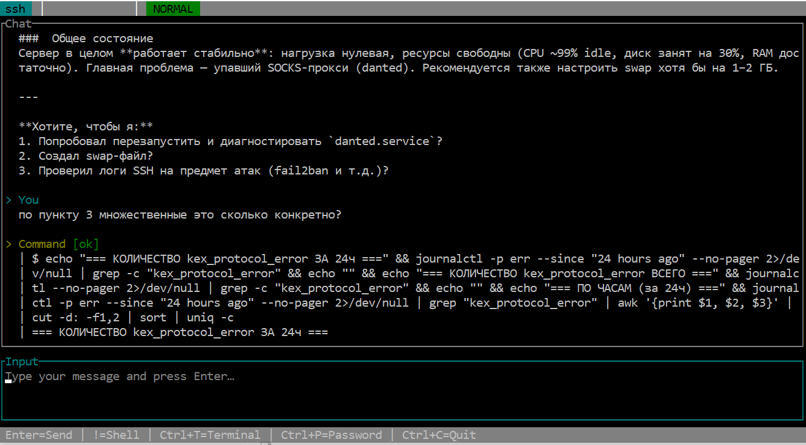

# Filar. 

**Filar Is a Lightweight Agent for Remotes.**
**Terminal with AI agent over SSH.**

Filar is a Rust-based terminal application that integrates an AI agent (LLM) with SSH remote execution. The agent can run commands on your local machine or on a remote server via SSH — with user confirmation for every action.


---

## Features

- **AI Agent** — powered by any OpenAI-compatible LLM (default: GLM), with tool calling support
- **SSH Remote Execution** — agent manages remote machines via SSH, zero-install (no files left on the remote)
- **Local Mode** — run commands on your own machine via PowerShell
- **TUI Interface** — built with [ratatui](https://ratatui.rs/) + [crossterm](https://github.com/crossterm-rs/crossterm)
- **Mouse Support** — scroll wheel, click-to-expand command blocks, drag-to-select and copy text
- **Streaming Responses** — real-time streaming of LLM responses with spinner animation
- **GUI Launcher** — built with [egui](https://github.com/emilk/egui), for easy SSH profile and API key configuration
- **Command Confirmation** — every command requires user approval before execution
- **Shell Escape** — type `!command` for direct shell access without the agent
- **Session Persistence** — save and restore chat sessions
- **Secure Credential Storage** — API keys and SSH passwords stored in OS Credential Manager (not in plain text files)
- **Interactive Terminal** — full terminal emulation via [alacritty_terminal](https://github.com/alacritty/alacritty)

---

## Screenshots



---

## Using filar as a Library

filar's engine crates (`filar-core`, `filar-transport`, `filar-agent`) can be
used as dependencies in external projects — Telegram bots, mobile apps, or
any SSH-based agent frontend. See [`docs/ENGINE_API.md`](docs/ENGINE_API.md)
for a consumer guide with Cargo.toml example and a minimal code sample.

---

## Getting Started

### Prerequisites

- **Rust** (stable, [rustup](https://rustup.rs/))
- **Windows** with either:
  - Visual Studio Build Tools (MSVC target), or
  - MinGW/GCC (GNU target) — see `.cargo/config.toml.example`
- An **LLM API key** (e.g. GLM / OpenAI-compatible)

### Build

```powershell
git clone https://github.com/devlawey/filar.git
cd filar
cargo build --release
```

The executable will be at `target\release\filar.exe`.

### Configuration (optional)

Filar works without a config file — the GUI launcher handles everything. For CLI usage, create `config.toml`:

```toml
confirm_mode = "allowlist"

[llm]
model = "glm-5.1"
api_base_url = "https://open.bigmodel.cn/api/paas/v4"
max_tokens = 4096

[timeouts]
command_secs = 120
llm_secs = 60
connect_secs = 15

# SSH targets (optional)
[[ssh_targets]]
name = "my-server"
host = "192.168.1.100"
port = 22
user = "admin"

[ssh_targets.auth]
type = "password"
```

### Run

Just double-click `filar.exe` — the GUI launcher will appear.

From the GUI you can:
- Enter your LLM API key (saved in OS Credential Manager)
- Choose Local or SSH mode
- Configure up to 5 SSH profiles
- Start a session

Or via command line:

```powershell
# Local mode
filar --target local

# SSH mode (requires config.toml)
filar --target my-server --llm default

# Restore a previous session
filar --session <session-id>
```

---

## Choosing an LLM

Filar works with **any OpenAI-compatible** `chat/completions` endpoint — the
agent client is not GLM-specific. You switch providers by changing only the
config (`model`, `api_base_url`, and the API key env var).

The default profile points at the GLM cloud (`open.bigmodel.cn`,
`GLM_API_KEY`). To use a local model (Ollama / LM Studio) or another cloud
provider, point `api_base_url` at its OpenAI-compatible base URL and supply
the key its API expects (local servers usually accept any non-empty string):

```toml
[llm]
model = "llama3.1"
api_base_url = "http://localhost:11434/v1"
max_tokens = 4096
temperature = 0.3          # local models benefit from lower temperature
```

### Verified providers

| Provider | Endpoint | Tool calling | Streaming | Notes |
|----------|----------|--------------|-----------|-------|
| GLM cloud | `https://open.bigmodel.cn/api/paas/v4` | verified | verified | Default profile; key via `GLM_API_KEY`. |
| Ollama (local) | `http://localhost:11434/v1` | pending manual check | pending manual check | OpenAI-compatible; set a non-empty key. |

> The table lists only what has been checked by hand. Add rows as more
> providers are verified (including via the eval tasks of milestone v0.4.0).

### Provider differences to be aware of

These are known OpenAI-compatibility quirks that may surface in filar's request
cycle. They are **not** patched with hacks in the client; they are documented
here, and critical ones get separate issues.

- **Streaming `tool_calls` deltas** — filar accumulates streamed tool-call
  fragments keyed by the `index` field (per the OpenAI streaming spec). GLM
  follows this. If a provider streams tool calls without a stable `index`,
  accumulation may mis-order; verify per provider.
- **Non-empty `content` on assistant tool-call messages** — filar always
  serializes a `content` string (possibly empty) on assistant messages that
  carry `tool_calls`. Some servers reject an empty/`null` `content` in that
  case; if so, file an issue rather than special-casing the client.
- **Empty `tools` array** — filar omits `tools` entirely when empty
  (`skip_serializing_if = "Vec::is_empty"`), confirmed by tests. Servers that
  reject a present-but-empty `tools` array are therefore unaffected.

---

## Usage

### Agent Mode

Type a natural language request and press Enter. The agent will:
1. Analyze your request
2. Propose commands (with explanations)
3. Wait for your confirmation: `[a]pprove` / `[d]eny` / `[e]dit`
4. Execute and show results
5. Continue until the task is done

**Example:**
```
> Find what process is listening on port 8080 and show its working directory
```

### Shell Escape

Type `!` followed by a command to run it directly (bypassing the agent):

```
!ls -la
!ping google.com
!ssh user@host
```

### Keyboard Shortcuts

| Key | Action |
|-----|--------|
| `Enter` | Send message / Confirm selected button |
| `Ctrl+Q` | Quit the app (denies a pending command first in Confirming) |
| `Ctrl+Z` | Cancel: stop the agent (Thinking) / deny the command (Confirming) |
| `Ctrl+C` | Nothing — left free so it can be used to copy the selection |
| `Ctrl+T` | Toggle interactive terminal view (persistent per tab since v0.6.0) |
| `Ctrl+Tab` / `Ctrl+Shift+Tab` | Switch session tab (works in interactive too) |
| `Ctrl+N` | New local session tab |
| `Ctrl+W` | Close active session tab |
| `Ctrl+P` | Enter password input mode (masked) |
| `Up/Down` | Browse input history |
| `!command` | Shell escape (direct execution) |
| `Mouse wheel` | Scroll chat history / terminal scrollback |
| `Click` | Expand/collapse command output blocks |
| `Drag` | Select text and copy to clipboard |

Shortcuts also work on the Russian ЙЦУКЕН layout (`Ctrl+Й`/`Ctrl+Я`/`Ctrl+Е`/`Ctrl+З`).

**Interactive terminal:** since v0.6.0, each tab has its own persistent terminal.
`Ctrl+T` toggles the view without killing the PTY — background processes keep running.
`Ctrl+Tab`/`Ctrl+N`/`Ctrl+W` work from within interactive mode. Switch to another
tab while a command runs, come back later — everything is as you left it.
Closing a tab closes its terminal. The tab bar shows activity indicators:
`●` = agent running, `?` = awaiting confirmation, `○` = new output in background.

All other keys in interactive mode — including `Ctrl+C/Q/Z` — are forwarded
to the remote program; use `Ctrl+T` to return to agent mode.

### SSH Connection

From the GUI: select an SSH profile and click Launch.

From the TUI: type `!ssh user@host` in Normal mode, then press `Ctrl+P` to enter the password.

---

## Architecture

```
filar/
├── crates/
│   ├── core/        # Config, errors, secrets, chat, sessions
│   ├── transport/   # CommandExecutor trait: SSH + Local implementations
│   ├── agent/       # LLM client (OpenAI-compatible), agent loop, tools, security
│   ├── tui/         # Terminal UI (ratatui + crossterm + alacritty_terminal)
│   ├── gui/         # GUI launcher (egui + keyring)
│   └── app/         # Binary: ties everything together
├── pics/            # Application icons
├── docker/          # Test SSH server (Docker)
├── config.toml      # Sample configuration
└── Cargo.toml       # Workspace manifest
```

### Key Design Decisions

- **Swappable Executor** — `CommandExecutor` trait allows switching between Local and SSH at runtime
- **Zero-Install SSH** — no files are left on the remote machine; all commands are injected via the SSH channel
- **Secure by Default** — all commands require confirmation; destructive commands are detected and blocked
- **Dynamic System Prompt** — the agent's system prompt adapts to local/SSH context and OS/shell type
- **OS Credential Storage** — API keys and SSH passwords stored via `keyring` (Windows Credential Manager)

---

## Testing

```powershell
cargo test
```

62 unit tests covering:
- Agent loop (text response, tool calls, max iterations)
- OpenAI-compatible client (serialization, deserialization)
- Security (destructive command detection, confirm modes)
- Tools (parsing, shell quoting)
- TUI (terminal model, key mapping, app state)
- Sessions (save/load roundtrip, pruning)

SSH integration tests require a Docker `sshd` container (skipped if Docker is not available).

---

## Tech Stack

| Component | Crate |
|-----------|-------|
| Async runtime | `tokio` |
| SSH client | `russh` |
| HTTP client | `reqwest` |
| TUI framework | `ratatui` + `crossterm` |
| Terminal emulation | `alacritty_terminal` |
| GUI | `egui` / `eframe` |
| Credential storage | `keyring` |
| Serialization | `serde` + `serde_json` + `toml` |
| Error handling | `thiserror` + `anyhow` |
| Logging | `tracing` + `tracing-subscriber` + `tracing-appender` |
| Image decoding | `image` |

---

## Project Structure

- **[PLAN.md](PLAN.md)** — Full development roadmap (8 stages)
- **[PROGRESS.md](PROGRESS.md)** — Current project state and feature list
- **[config.toml](config.toml)** — Sample configuration file

---

## Logging

Application logs are written to:
- `%APPDATA%\filar\filar.log` (Windows)
- `~/.local/share/filar/filar.log` (Linux)

For verbose logging:
```powershell
$env:RUST_LOG="debug"
filar.exe
```

---

## License

[MIT](LICENSE) — Copyright (c) 2026 devlawey
