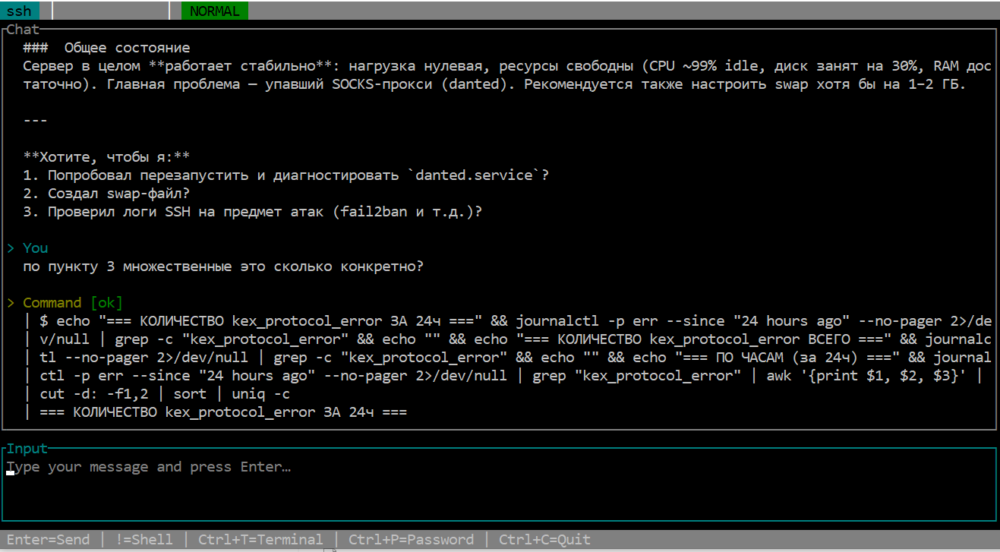

# Filar. 

**Filar Is a Lightweight Agent for Remotes.**
**Terminal with AI agent over SSH.**

Filar is a Rust-based terminal application that integrates an AI agent (LLM) with SSH remote execution. The agent can run commands on your local machine or on a remote server via SSH — with user confirmation for every action.


---

## Features

- **AI Agent** — powered by any OpenAI-compatible LLM (default: GLM), with tool calling support
- **SSH Remote Execution** — agent manages remote machines via SSH, zero-install (no files left on the remote)
- **Local Mode** — run commands on your own machine (PowerShell on Windows; POSIX `sh -c` on macOS)
- **TUI Interface** — built with [ratatui](https://ratatui.rs/) + [crossterm](https://github.com/crossterm-rs/crossterm)
- **Mouse Support** — scroll wheel, click-to-expand command blocks, drag-to-select and copy text
- **Streaming Responses** — real-time streaming of LLM responses with spinner animation
- **GUI Launcher** — built with [egui](https://github.com/emilk/egui), with a **Models tab** for managing multiple LLM profiles (each with its own API key, saved in OS Credential Manager)
- **Multi-Model Support** — `Ctrl+L` cycles through LLM profiles per tab; different tabs can use different models simultaneously
- **Command Confirmation** — every command requires user approval before execution
- **Shell Escape** — type `!command` for direct shell access without the agent
- **Session Persistence** — save and restore chat sessions, including agent input history (Up/Down recalls prompts from previous sessions)
- **Secure Credential Storage** — API keys and SSH passwords stored in OS Credential Manager (not in plain text files)
- **Token Usage Counter** — real API usage data shown in the status bar per session (`toks: N↑ M↓`)
- **Interactive Terminal** — full terminal emulation via [alacritty_terminal](https://github.com/alacritty/alacritty)

---

## Screenshots



---

## Using filar as a Library

filar's engine crates (`filar-core`, `filar-transport`, `filar-agent`) can be
used as dependencies in external projects — Telegram bots, mobile apps, or
any SSH-based agent frontend. See [`docs/ENGINE_API.md`](docs/ENGINE_API.md)
for a consumer guide with Cargo.toml example and a minimal code sample.

---

## Getting Started

**Supported platforms for 1.0.0:** Windows (x86_64) and macOS (Apple Silicon /
`aarch64`). Linux paths exist in the engine but are **not** a release target
for 1.0.0.

### Prerequisites

- **Rust** (stable, [rustup](https://rustup.rs/))
- **Windows** with either:
  - Visual Studio Build Tools (MSVC target), or
  - MinGW/GCC (GNU target) — see `.cargo/config.toml.example`
- **macOS** (Apple Silicon): Xcode Command Line Tools (`xcode-select --install`)
- An **LLM API key** (e.g. GLM / OpenAI-compatible)

### Build

```bash
git clone https://github.com/devlawey/filar.git
cd filar
cargo build --release
```

| Platform | Binary |
|----------|--------|
| Windows | `target\release\filar.exe` |
| macOS | `target/release/filar` |

Or download release assets from [GitHub Releases](https://github.com/devlawey/filar/releases)
(1.0.0 ships **unsigned** binaries — same OSS policy on Windows and macOS;
see [#80](https://github.com/devlawey/filar/issues/80) / `docs/PLATFORM_NOTES.md`):

| Platform | Asset | After download |
|----------|--------|----------------|
| Windows | `filar-*-windows-x86_64.exe` | If SmartScreen warns: More info → Run anyway |
| macOS (Apple Silicon) | `filar-*-macos-aarch64` (raw binary, **not** a `.app`) | `chmod +x … && xattr -d com.apple.quarantine …` |

```bash
# macOS (Gatekeeper quarantine on browser/GitHub downloads)
chmod +x filar-*-macos-aarch64 && xattr -d com.apple.quarantine filar-*-macos-aarch64
```

### Configuration

Filar stores configuration in **three places**. Most users never need to
think about this — the GUI launcher handles everything automatically.

#### 1. GUI Launcher settings (`settings.json`)

Location: `%APPDATA%\filar\settings.json` (Windows),
`~/Library/Application Support/filar/settings.json` (macOS),
`~/.local/share/filar/settings.json` (Linux; or `$XDG_DATA_HOME/filar/`).

The launcher saves non-sensitive UI state here: SSH profiles (host, port,
user, alias), model name, API base URL, temperature, extra body JSON, save
directory, and the last selected target/profile. **No secrets** — API keys
and SSH passwords go to the OS Credential Manager.

You never edit this file manually — the launcher reads/writes it on every
Launch.

#### 2. Handoff file (`pending_launch.json`)

Location: `{OS data dir}/filar/pending_launch.json` (same directory as
`settings.json` — see above).

A **transient** file written by the launcher on "Launch" and read+deleted by
the TUI subprocess. It carries the launch-specific settings (model, API URL,
LLM profiles, SSH targets, save directory, selected target) from the GUI to
the TUI. Users never see or edit this file.

If you launch the TUI directly (CLI mode, without the GUI), this file does
not exist — the TUI falls back to `config.toml`.

#### 3. Fallback config (`config.toml`)

Location (search order):
1. `FILAR_CONFIG` env var (explicit path)
2. `./config.toml` in the current working directory
3. `{OS data dir}/filar/config.toml` (app-data dir — **the launcher writes here**)
4. `config.toml` next to the executable

**When is `config.toml` created?** The launcher writes the `[llm]` section
(model, api_base_url, temperature, extra_body) to `{OS data dir}/filar/config.toml`
on every Launch, as a fallback for CLI usage. It merges into the existing
file — it does not overwrite `[[ssh_targets]]`, `[[llm_profiles]]`, or
other sections you may have added manually.

**When do you need `config.toml`?**
- **GUI users**: never. The launcher + `pending_launch.json` handle everything.
- **CLI users** (`filar --target ...`): the TUI reads `config.toml` because
  there is no `pending_launch.json`. This is where you define SSH targets,
LLM profiles, timeouts, and the default confirm mode.
- **Power users**: edit `{OS data dir}/filar/config.toml` manually to add
  `[[llm_profiles]]`, tweak `[timeouts]`, or set `confirm_mode`. The
  launcher will preserve these sections on next Launch.

#### Secrets (OS Credential Manager)

API keys and SSH passwords are stored in the **OS Credential Manager**
(Windows Credential Manager, macOS Keychain, Linux Secret Service). They are
**never** written to `config.toml`, `settings.json`, `pending_launch.json`,
or log files.

In the GUI launcher, the API key is entered in the UI field and saved
automatically on first Launch. SSH passwords are saved when you check
"Save password" for that SSH slot.

In CLI mode, set environment variables:
```powershell
$env:GLM_API_KEY = "your-key"       # default profile
$env:DEEPSEEK_API_KEY = "your-key"  # named profile
$env:SSH_PASSWORD = "ssh-password"   # SSH auth type = "password"
```

#### config.toml reference

```toml
# ── Confirmation mode ──────────────────────────────────────
confirm_mode = "allowlist"
#   always    — every command requires explicit user approval
#   allowlist — read-only commands auto-approved, others require confirmation (default)
#   never     — no confirmation (dangerous, sandbox only)
#   explain   — safe mode: agent tool calls require approval AND a mandatory
#               explanation. Toggle at runtime with F2. Session is auto-saved
#               to Markdown. (!command shell escape is not affected.)

# ── LLM (default profile) ─────────────────────────────────
[llm]
model = "glm-5.1"
api_base_url = "https://open.bigmodel.cn/api/paas/v4"
max_tokens = 4096
# temperature = 0.3         # optional (0.0–2.0)
# top_p = 0.9              # optional (0.0–1.0]
# [llm.extra_body]          # optional, arbitrary fields merged into request
# thinking = { type = "disabled" }

# ── Additional LLM profiles ────────────────────────────────
# Each profile can use a different model/provider. Keys are stored
# in the OS credential manager under the name specified by `key_env`.
[[llm_profiles]]
name = "deepseek"
model = "deepseek-chat"
api_base_url = "https://api.deepseek.com/v1"
max_tokens = 8192
key_env = "DEEPSEEK_API_KEY"

# ── Timeouts (seconds) ─────────────────────────────────────
[timeouts]
command_secs = 300   # single command execution
llm_secs = 60        # one non-streaming LLM call; for streaming replies,
                     # the longest allowed pause between chunks
connect_secs = 15    # SSH connection establishment

# ── SSH targets ────────────────────────────────────────────
# The launcher syncs its SSH profiles into this section on every Launch.
# You can also add targets manually — the launcher preserves non-matching entries.
[[ssh_targets]]
name = "my-server"
host = "192.168.1.100"
port = 22
user = "admin"

[ssh_targets.auth]
type = "agent"        # agent | key | password
# path = "~/.ssh/id_ed25519"  # only for type = "key"
# password = "..."            # only for type = "password" (prefer SSH_PASSWORD env)

# ── Save directory for session exports ────────────────────
# Where Ctrl+S and auto-transcript (Explain mode) write .md files.
# None = current working directory.
# save_dir = "C:\\Users\\me\\Documents\\filar-transcripts"
```

### Run

Double-click the binary (`filar.exe` on Windows, `filar` on macOS) — the GUI
launcher appears.

From the GUI you can:
- Enter your LLM API key (saved in Windows Credential Manager or macOS Keychain)
- Choose Local or SSH mode
- Configure up to 5 SSH profiles
- Start a session

Or via command line (reads `config.toml`, no GUI):

```bash
# Local mode
filar --target local

# SSH mode (requires config.toml with [[ssh_targets]])
filar --target my-server --llm default

# Restore a previous session
filar --session <session-id>
```

---

## Choosing an LLM

Filar works with **any OpenAI-compatible** `chat/completions` endpoint — the
agent client is not GLM-specific. You switch providers by changing only the
config (`model`, `api_base_url`, and the API key env var).

The default profile points at the GLM cloud (`open.bigmodel.cn`,
`GLM_API_KEY`).

### Local / air-gapped models (ollama, vLLM, LM Studio, …)

Closed networks and air-gapped setups can point filar at a **local**
OpenAI-compatible server. **Request data stays on that endpoint** — nothing is
sent to a public cloud when `api_base_url` is local or internal.

1. Run a server that exposes `/v1/chat/completions` (example: ollama).
2. Create a profile with:
   - **API URL** such as `http://localhost:11434/v1` (hint in the GUI)
   - **Key env left empty** — that is the explicit “no API key” marker
   - **API key** empty
3. Launch. `Ctrl+L` can switch between local and cloud profiles.

```toml
[[llm_profiles]]
name = "ollama"
model = "llama3.1"
api_base_url = "http://localhost:11434/v1"
max_tokens = 4096
key_env = ""          # empty = keyless; Authorization header is not sent
temperature = 0.3
```

**Tool calling required.** The agent loop needs models that support
OpenAI-style tools/`function` calling. Without it, filar cannot run commands
and shows a clear error — it does **not** fake tools by parsing free text.

**Timeouts.** Local CPU generation is often slower than cloud. Raise
`[timeouts].llm_secs` in `config.toml` (default `60`) if requests time out.
The timeout applies to every profile (including local). For streaming replies
it bounds the **pause between chunks**, not the total length of the answer —
a model that keeps producing tokens is never cut off, however long it takes.
For non-streaming calls it still bounds the whole request.

**Context window.** Automatic context compression is not implemented yet.
Local models usually have smaller windows (8k–32k); keep sessions short or
trim history manually until compression lands.

**Usage / cost.** Local servers often omit `usage`; the status bar shows
`toks: —` and no `$0.00` placeholder.

### Cloud / other providers

Point `api_base_url` at the provider and set a non-empty `key_env` (key via
env or OS credential store / GUI):

```toml
[[llm_profiles]]
name = "glm"
model = "glm-5.1"
api_base_url = "https://open.bigmodel.cn/api/paas/v4"
max_tokens = 4096
key_env = "GLM_API_KEY"
```

> For local keyless use, prefer `key_env = ""` (see above). The default `[llm]`
> block still expects `GLM_API_KEY` unless you select a keyless profile.

### Verified providers

| Provider | Endpoint | Tool calling | Streaming | Notes |
|----------|----------|--------------|-----------|-------|
| GLM cloud | `https://open.bigmodel.cn/api/paas/v4` | verified | verified | Default profile; key via `GLM_API_KEY`. |
| Ollama (local) | `http://localhost:11434/v1` | pending manual check | pending manual check | Use empty `key_env`; pick a model with tool support. |

> The table lists only what has been checked by hand. Add rows as more
> providers are verified (including via the eval tasks of milestone v0.4.0).

### Provider differences to be aware of

These are known OpenAI-compatibility quirks that may surface in filar's request
cycle. They are **not** patched with hacks in the client; they are documented
here, and critical ones get separate issues.

- **Streaming `tool_calls` deltas** — filar accumulates streamed tool-call
  fragments keyed by the `index` field (per the OpenAI streaming spec). GLM
  follows this. If a provider streams tool calls without a stable `index`,
  accumulation may mis-order; verify per provider.
- **Non-empty `content` on assistant tool-call messages** — filar always
  serializes a `content` string (possibly empty) on assistant messages that
  carry `tool_calls`. Some servers reject an empty/`null` `content` in that
  case; if so, file an issue rather than special-casing the client.
- **Empty `tools` array** — filar omits `tools` entirely when empty
  (`skip_serializing_if = "Vec::is_empty"`), confirmed by tests. Servers that
  reject a present-but-empty `tools` array are therefore unaffected.

---

## Usage

### Agent Mode

Type a natural language request and press Enter. The agent will:
1. Analyze your request
2. Propose commands (with explanations)
3. Wait for your confirmation: `[a]pprove` / `[d]eny` / `[e]dit`
4. Execute and show results
5. Continue until the task is done

**Example:**
```
> Find what process is listening on port 8080 and show its working directory
```

### Shell Escape

Type `!` followed by a command to run it directly (bypassing the agent):

```
!ls -la
!ping google.com
!ssh user@host
```

### Keyboard Shortcuts

| Key | Action |
|-----|--------|
| `F1` | Show full help overlay (all shortcuts and commands grouped by section) |
| `F2` | Toggle safe mode (Explain): agent must justify each command; session auto-saved to Markdown |
| `Enter` | Send message / Confirm selected button |
| `Ctrl+Q` | Quit the app (denies a pending command first in Confirming) |
| `Ctrl+Z` | Cancel: stop the agent (Thinking) / deny the command (Confirming) |
| `Ctrl+C` | Nothing — left free so it can be used to copy the selection |
| `Ctrl+T` | Toggle interactive terminal (opens on the current tab's host — local or SSH) |
| `Ctrl+Tab` / `Ctrl+Shift+Tab` | Switch session tab (works in interactive too) |
| `Ctrl+N` | New local session tab (always local, never inherits another tab's SSH) |
| `Ctrl+W` | Close active session tab |
| `Ctrl+L` | Cycle LLM profile for this tab (different model per tab) |
| `Ctrl+O` | Open host-selection overlay (local + configured `[[ssh_targets]]`) |
| `Ctrl+V` | Paste from system clipboard (also via bracketed paste) |
| `Ctrl+P` | Enter password input mode (masked) |
| `Up/Down` | Browse agent input history (persisted across sessions since v0.6.1) |
| `!command` | Shell escape (direct execution) |
| `Mouse wheel` | Scroll chat history / terminal scrollback |
| `Click` | Expand/collapse command output blocks |
| `Drag` | Select text and copy to clipboard |

Shortcuts also work on the Russian ЙЦУКЕН layout (`Ctrl+Й`/`Ctrl+Я`/`Ctrl+Е`/`Ctrl+З`).

**Interactive terminal:** since v0.6.0, each tab has its own persistent terminal.
`Ctrl+T` toggles the view without killing the PTY — background processes keep running.
The terminal opens on the **current tab's host** (local for a local tab, SSH host for a
tab connected via `!ssh`). Tab labels reflect the actual target: `local-N` for local tabs,
`user@host` for SSH tabs.
`Ctrl+Tab`/`Ctrl+N`/`Ctrl+W` work from within interactive mode. Switch to another
tab while a command runs, come back later — everything is as you left it.
Closing a tab closes its terminal. The tab bar shows activity indicators:
`●` = agent running, `?` = awaiting confirmation, `○` = new output in background.

All other keys in interactive mode — including `Ctrl+C/Q/Z` — are forwarded
to the remote program; use `Ctrl+T` to return to agent mode.

### SSH Connection

From the GUI: select an SSH profile and click Launch.

From the TUI: 
- Type `!ssh user@host` for one-off connections to hosts not in the configuration, 
  then press `Ctrl+P` to enter the password.
- Use `Ctrl+O` to open a host-selection overlay listing `local` plus all configured
  `[[ssh_targets]]`. Navigate with `↑`/`↓`, press `Enter` to connect to the selected
  host, or `Esc` to cancel. The target alias is shown in the status bar with a `~`
  prefix until the connection succeeds.
- The connection applies **only to the current tab** — other tabs keep their
  existing connections. Each tab can be connected to a different host, or stay local.
- When using `[[ssh_targets]]`, SSH passwords are stored in the OS credential store 
  (never in `config.toml`). For key-based auth and SSH agent, no password is needed.
- SSH profiles configured in the **GUI launcher** are automatically synced to 
  `[[ssh_targets]]` in `config.toml` on every Launch. You can also add targets 
  manually:

```toml
[[ssh_targets]]
name = "my-server"
host = "192.168.1.100"
port = 22
  user = "root"

[ssh_targets.auth]
type = "agent"
```

**Launcher-generated targets** use the alias (or `SSH1`–`SSH5` if no alias is set):

```toml
[[ssh_targets]]
name = "SSH1"
host = "10.0.0.5"
port = 22
user = "admin"
auth = { type = "agent" }
```

---

## Architecture

```
filar/
├── crates/
│   ├── core/        # Config, errors, secrets, chat, sessions
│   ├── transport/   # CommandExecutor trait: SSH + Local implementations
│   ├── agent/       # LLM client (OpenAI-compatible), agent loop, tools, security
│   ├── tui/         # Terminal UI (ratatui + crossterm + alacritty_terminal)
│   ├── gui/         # GUI launcher (egui + keyring)
│   └── app/         # Binary: ties everything together
├── pics/            # Application icons
├── docker/          # Test SSH server (Docker)
├── config.toml      # Sample configuration
└── Cargo.toml       # Workspace manifest
```

### Key Design Decisions

- **Swappable Executor** — `CommandExecutor` trait allows switching between Local and SSH at runtime; since v0.6.1, each tab has its own executor, so `!ssh` reconnects only the current tab
- **Zero-Install SSH** — no files are left on the remote machine; all commands are injected via the SSH channel
- **Secure by Default** — all commands require confirmation; destructive commands are detected and blocked
- **Dynamic System Prompt** — the agent's system prompt adapts to local/SSH context and OS/shell type
- **OS Credential Storage** — API keys and SSH passwords stored via `keyring`
  (Windows Credential Manager / macOS Keychain)

---

## Testing

```powershell
cargo test
```

62 unit tests covering:
- Agent loop (text response, tool calls, max iterations)
- OpenAI-compatible client (serialization, deserialization)
- Security (destructive command detection, confirm modes)
- Tools (parsing, shell quoting)
- TUI (terminal model, key mapping, app state)
- Sessions (save/load roundtrip, pruning)

SSH integration tests require a Docker `sshd` container (skipped if Docker is not available).

---

## Tech Stack

| Component | Crate |
|-----------|-------|
| Async runtime | `tokio` |
| SSH client | `russh` |
| HTTP client | `reqwest` |
| TUI framework | `ratatui` + `crossterm` |
| Terminal emulation | `alacritty_terminal` |
| GUI | `egui` / `eframe` |
| Credential storage | `keyring` |
| Serialization | `serde` + `serde_json` + `toml` |
| Error handling | `thiserror` + `anyhow` |
| Logging | `tracing` + `tracing-subscriber` + `tracing-appender` |
| Image decoding | `image` |

---

## Project Structure

- **[PLAN.md](PLAN.md)** — Full development roadmap (8 stages)
- **[PROGRESS.md](PROGRESS.md)** — Current project state and feature list
- **[config.toml](config.toml)** — Sample configuration file

---

## Logging

Application logs are written to:
- `%APPDATA%\filar\logs\filar.log` (Windows)
- `~/Library/Application Support/filar/logs/filar.log` (macOS)
- `~/.local/share/filar/logs/filar.log` (Linux)

For verbose logging:
```powershell
$env:RUST_LOG="debug"
filar.exe
```

---

## License

[MIT](LICENSE) — Copyright (c) 2026 devlawey
